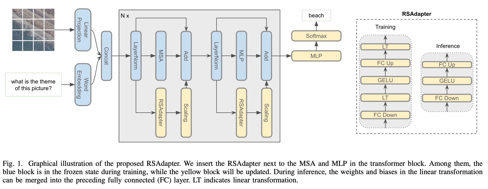

# RSAdapter

The official PyTorch implementation of the paper "[RSAdapter: Adapting Multimodal Models for Remote Sensing Visual Question Answering](https://arxiv.org/pdf/2310.13120.pdf)".

The code will be released soon.
